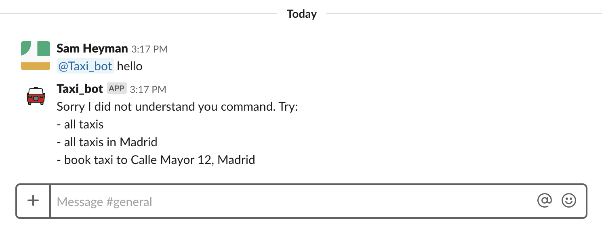
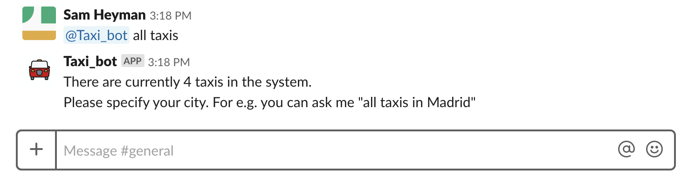
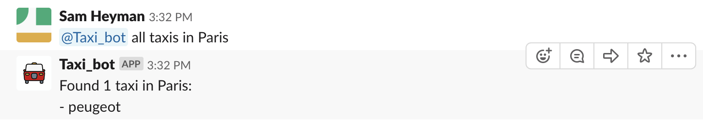
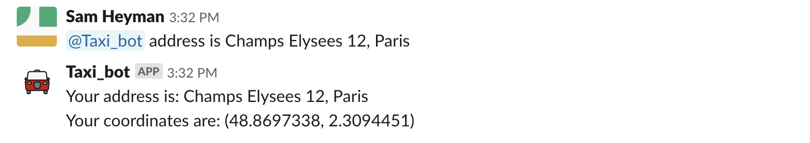

# Taxi Slack Bot

Simple Slack Bot to order taxis. Uses the [mock taxi API](https://github.com/samheyman/mock-travel-apis) for taxi data.

## Screenshots

### Call the bot and view help



### Ask for taxis



### Ask for taxis in a city



### Set pick-up address



### Order taxi


## Usage

These instructions will get you a copy of the project up and running on your local machine for development and testing purposes. 

### Prerequisites

What you will need:

* python 3.6
* pip
* pipenv

### Installing

To run it locally:

* Create a new Slack app and get the `Slack token`
for more details on this see this [tutorial](https://www.fullstackpython.com/blog/build-first-slack-bot-python.html)

* Install the requirements
```
pipenv install
```
* Run the server
```
pipenv run python taxi_bot/taxi_bot.py
```
* Open Slack and call the bot with the following requests:
```
"all taxis" 
"all taxis in Madrid"
"book taxi to Calle Mayor 12, Madrid"
```


## Authors

* [Sam Heyman](http://samheyman.com)


## License

This project is licensed under the MIT License - see the [LICENSE.md](LICENSE.md) file for details

## Acknowledgments

Built with help of this very good tutorial:
* Matt Makai - [How to Build Your First Slack Bot with Python](https://www.fullstackpython.com/blog/build-first-slack-bot-python.html
)
